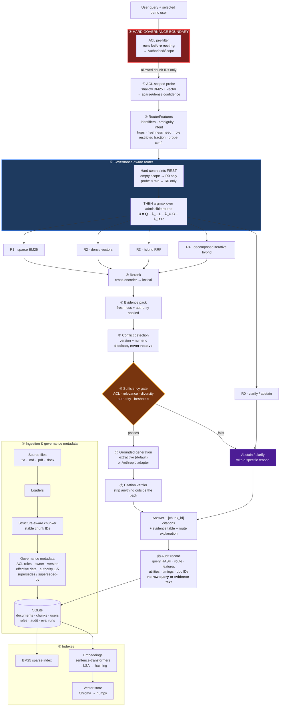

# AHRAG — Adaptive Hybrid Retrieval-Augmented Generation

A local, fully offline research prototype of a **governance-aware adaptive router**
for enterprise RAG.

The organising claim the code is built to demonstrate, and that the evaluation
harness is built to test:

> Route selection is constrained by authorised source scope and optimised for
> evidence sufficiency, freshness, source authority, estimated latency, and
> estimated cost — not merely query complexity.

Every claim in this README is backed by a test or by output from an actual run.
Nothing here is asserted to be novel, patentable, or state of the art. See
[`RESEARCH_LIMITATIONS.md`](RESEARCH_LIMITATIONS.md) for what this prototype
cannot show, and [`INVENTION_DISCLOSURE.md`](INVENTION_DISCLOSURE.md) for
mechanisms that may be differentiating, together with the prior art that a
patent professional would need to weigh against them.

---

## Quick start

Three commands. No Docker, no API keys, no model downloads, no network.

```bash
python3 -m venv .venv && source .venv/bin/activate
pip install -r requirements.txt
cp .env.example .env                       # optional; all values have defaults

# 1. Run the evaluation (seeds the demo corpus, runs 8 systems x 32 items)
python -m ahrag.evaluate --per-type

# 2. Run the tests
pytest

# 3. Run the app
python -m uvicorn "ahrag.api.app:create_app" --factory --port 8000   # terminal 1
streamlit run ahrag/ui/app.py                                        # terminal 2
```

Then open <http://localhost:8501>. The Streamlit UI detects the API on
`http://127.0.0.1:8000`; if the API is not running it falls back to an
in-process engine and says so in the sidebar, so `streamlit run` alone is enough
for a demo.

**Requirements:** Python 3.11+ (developed and tested on 3.12). No other
prerequisites.

---

## Architecture



The red boundary is the load-bearing design decision. ACL is **not** a term in
the utility function and **not** a post-retrieval filter — it is a set-membership
constraint applied before the router runs. Unauthorised chunks are never
candidates, so they cannot influence the route choice, the ranking, the answer,
the citations, or the log. Cost-optimal routing cannot trade governance for
latency because that trade is not representable.

---

## The routing decision

### The utility function

```
U(z | x) = Q(z|x) − λ_latency · L(z|x) − λ_cost · C(z|x) − λ_risk · R(z|x)
```

subject to `z ∈ admissible(x)`, where `admissible` is determined **before** any
utility is computed.

| Term | Meaning | Where it comes from |
|---|---|---|
| `Q` | Expected evidence quality | Interpretable linear model over 23 features, weights in `config/router.yaml` |
| `L` | Estimated latency (s) | Per-route priors × expected R4 iterations |
| `C` | Estimated cost (USD) | Per-route token budget × local price constants |
| `R` | Evidence + governance risk | Base rate + freshness penalty + restricted-scope term + low-probe term |

Every coefficient, threshold, weight, and lexicon lives in
[`config/router.yaml`](config/router.yaml). Nothing is hard-coded in Python.
Change a number and re-run `python -m ahrag.evaluate` to see the effect —
`tests/test_routing.py::test_latency_lambda_changes_the_choice` verifies that
λ is a real control and not a decorative config value.

### Hard constraints (evaluated first, cannot be outbid)

1. **Empty authorised scope → only R0 is admissible.** A user who can read
   nothing gets abstention, whatever the query looks like.
2. **Probe confidence below `min_probe_for_answering` → only R0.** No authorised
   evidence is worth generating from.
3. **R0 is structurally non-generative.** It may clarify or abstain. It may
   never answer an enterprise factual question from model memory.

`tests/test_routing.py::test_high_confidence_cannot_outbid_empty_scope` proves
point 1 holds even when the excluded routes carry *higher* raw utility.

### Why the router is interpretable, not learned

The research draft proposes a trained router (gradient-boosted or small-LM
classifier) fitted on offline route labels. Building that here would mean either
shipping an untrained model or fabricating labels, so this prototype ships the
interpretable version and treats the learned router as an **open hypothesis**.
The feature extractor is rule-based with its lexicons in YAML, so a reviewer can
read exactly what triggers each route.

---

## Demo scenarios

All six are implemented as executable acceptance criteria in
[`tests/test_scenarios.py`](tests/test_scenarios.py) — if one stops being true,
a test fails.

| # | Scenario | User | Query | Behaviour |
|---|---|---|---|---|
| 1 | Exact error code | `alice.employee` | *What is the remediation for ERR-5041?* | **R1** — reasons name `ERR-5041` |
| 2 | Conceptual policy | `alice.employee` | *Why does the company use a hybrid working model…?* | **R2/R3** — semantic retrieval |
| 3 | Multi-document comparison | `carol.hr` | *Compare the annual leave carry-over rules between the current policy and the 2023 edition* | **R4** — sub-queries shown, both editions in evidence |
| 4 | Restricted finance | `alice.employee` | *What is the Q3 2026 revenue forecast and gross margin?* | **R0 abstention**, no figures leak, the document is not named |
| 5 | Conflicting versions | `carol.hr` | *What is the current annual leave entitlement now?* | Answers **26 days** from the live policy **and discloses** the 22-day retired version |
| 6 | Unsupported question | `erin.contractor` | *What is the airspeed velocity of an unladen swallow?* | Abstains with a stated reason, no citations |

Scenario 4 has a control case: `dan.finance` asking the *same question* gets the
answer. Without it the ACL tests would pass trivially on a system that never
answers anything.

The Streamlit "Ask" page has a **Demo scenarios** expander that loads each one
with the right user selected.

---

## Evaluation

```bash
python -m ahrag.evaluate                          # summary report
python -m ahrag.evaluate --per-type               # + per-query-type breakdown
python -m ahrag.evaluate --json data/eval.json    # + machine-readable results
python -m ahrag.evaluate --systems P1,B3          # subset
```

Eight systems over 32 labelled items. **All eight share the same corpus, chunking,
indexes, embedding backend, reranker, evidence gates, generator, and ACL
enforcement — only the routing policy differs.** That makes this an ablation of
routing, not a comparison of unrelated pipelines, and it is why the baselines
are not strawmen: every one of them gets the full governance stack.

| Key | System |
|---|---|
| B1 | Fixed BM25 (always R1) |
| B2 | Fixed dense (always R2) |
| B3 | Fixed hybrid RRF (always R3) |
| B4 | Always-maximal iterative hybrid (always R4) |
| B5 | Complexity-only router — the Adaptive-RAG premise, no governance signal |
| P1 | **Proposed governance-aware AHRAG router** |

### Measured results

Actual output of `python -m ahrag.evaluate --per-type` on the seeded corpus,
reference date 2026-08-19, backends `lsa` / `numpy` / `lexical` /
`extractive-deterministic`. **Reproduce it yourself before quoting it** — these
are not carried over from a prior run.

```
        R@5   R@10    MRR   nDCG   CitP  CitCov   Grnd  Abst✓  ACLv  Fresh   MeanS    p95S       $/q
B1    0.820  0.820  0.740  0.746  0.281   0.820  1.000  0.844     0  1.000  0.0009  0.0012  0.003759
B2    0.840  0.840  0.750  0.756  0.292   0.840  1.000  0.812     0  1.000  0.0009  0.0010  0.003837
B3    0.820  0.820  0.740  0.746  0.283   0.820  1.000  0.844     0  1.000  0.0009  0.0012  0.003765
B4    0.840  0.840  0.753  0.758  0.303   0.840  1.000  0.844     0  1.000  0.0009  0.0014  0.003750
B5    0.840  0.840  0.753  0.758  0.292   0.840  1.000  0.844     0  1.000  0.0010  0.0013  0.003763
P1    0.840  0.840  0.753  0.758  0.292   0.840  1.000  0.875     0  1.000  0.0010  0.0014  0.003687

ROUTE DISTRIBUTION
         R0     R1     R2     R3     R4    AbstRate
B1        0     32      0      0      0       0.125
B2        0      0     32      0      0       0.094
B3        0      0      0     32      0       0.125
B4        0      0      0      0     32       0.125
B5        0      0      6     23      3       0.125
P1        2      6      1     20      3       0.156
```

### What these numbers do and do not show

**They show three things.**

1. **ACL violation rate is 0 for every system** — the required result, verified
   by `tests/test_evaluation.py::test_acl_violation_rate_is_zero`. Note this is
   zero for the *baselines too*, and that is the point: the invariant lives
   upstream of routing, so no routing policy can break it. The metric verifies
   the invariant rather than flattering the proposal.
2. **P1 has the best abstention appropriateness (0.875 vs 0.812–0.844)**, and
   the per-type breakdown shows the entire gap comes from
   `permission_constrained` items (0.50 for P1 vs 0.25 for most baselines, 0.00
   for fixed-dense). This is the governance signal doing measurable work: P1 is
   the only system that ever selects R0, because it is the only one that can see
   that the authorised corpus is thin.
3. **P1 matches the best retrieval quality (R@5 0.840, tied with B4 and B5) at a
   lower estimated cost than B4** (0.003687 vs 0.003750 per query). That is the
   quality–efficiency trade-off from hypothesis H2, and it is real but small.

**They do not show a retrieval win.** P1 ties B4 and B5 on Recall@5, MRR, and
nDCG; it does not beat them. On a 9-document corpus almost everything is
findable by any route, so the suite genuinely cannot separate the retrieval
policies. Reporting a tie is the honest outcome.

**Latency differences are noise.** All systems run in ~1 ms because the corpus
is 60 chunks. The p95 spread is smaller than measurement jitter. Nothing about
production latency can be inferred from these numbers.

**Citation precision (~0.29) is a property of the generator, not the retriever.**
The extractive generator cites up to four passages while most items have one
gold chunk, so precision is structurally capped. Citation *coverage* (0.84) is
the more meaningful figure here.

P1's own remaining failures, from the same run:

| Item | What went wrong |
|---|---|
| `eq-005` | "Which policy code covers annual leave?" — retrieved leave chunks but not the one containing `POL-HR-014` |
| `sem-003` | "unused holiday when I leave the company" — vocabulary mismatch with "accrued but untaken leave"/"termination" |
| `sem-005` | "fall ill while on holiday" — same mismatch against "Sickness"/"annual leave"; abstained rather than answered |
| `cmp-001`, `cmp-003` | Retrieved one of two required policy editions, not both |
| `acl-003` | Contractor asking about `ERR-5041` got the *Atlas status report's* mention of it instead of abstaining. No leak, but a partially-responsive answer where refusal is better |
| `una-003` | "parental leave for adoptive parents" — answered from general leave-policy text; the corpus has no parental leave content |

These are the offline lexical stack's limits, discussed in
[`RESEARCH_LIMITATIONS.md`](RESEARCH_LIMITATIONS.md).

---

### Beyond the demo corpus

The figures in this section are from the packaged 9-document demo corpus, which
exists so the system runs offline with no downloads. A 6,139-document /
7,082-chunk benchmark corpus with 965 labelled queries, a 7-class ACL lattice
and 15 supersession chains is built by
`improvement_files/datasets/integrate_datasets.py`; every experiment script
takes `--integrated` to use it. Results on that corpus, including the ones that
came out negative, are in **`FINDINGS.md`**.

Two systems were added to the comparison set:

| Key | System |
|---|---|
| `B6` | Adaptive-RAG reimplementation — a *trained* complexity classifier over query-text features only, which is the shape of Jeong et al. (2024) rather than B5's hand-set token thresholds |
| `P2` | AHRAG learned router — the same hard governance constraints, with the admissible routes ranked by a trained classifier instead of hand-tuned utility weights |

`P2` is the answer to "is the routing actually learned?". The classifier ranks
only the routes the governance constraints already admitted, so it can change
which admissible route wins but cannot expand what is permitted;
`tests/test_routing.py::TestLearnedRouter` asserts that rather than assuming it.

## Governance model

### Demo corpus

9 documents, 60 chunks, seeded from
[`ahrag/seed/manifest.yaml`](ahrag/seed/manifest.yaml).

| Document | Type | Readable by | Version | Effective | Authority |
|---|---|---|---|---|---|
| Annual Leave Policy | policy | employee, manager, hr | 2.1 | 2025-01-01 | 5 |
| Annual Leave Policy (2023) | policy | employee, manager, hr | 1.4 | 2023-01-01 | 4 |
| Hybrid & Remote Working | policy | employee, manager, hr | 3.0 | 2026-01-01 | 5 |
| Expenses & Travel | policy | all five roles | 1.2 | 2025-03-01 | 4 |
| Payments Runbook | runbook | **engineering only** | 4.3 | 2026-02-01 | 4 |
| Security Incident Runbook | runbook | engineering, manager | 2.0 | 2025-10-01 | 4 |
| Project Atlas Q2 Status | report | employee, manager, engineering | 1.0 | 2026-07-04 | 3 |
| Platform Capacity Plan | report | engineering, manager | 1.1 | 2026-07-01 | 3 |
| **Q3 Revenue Forecast** | finance | **finance only** | 1.0 | 2026-07-10 | 4 |

The two leave-policy editions form a supersession chain (`supersedes` /
`superseded_by`) with different effective dates and a conflicting figure —
**26 days** vs **22 days** — which is what the conflict detector finds.

### Demo users

| User | Roles | Authorised scope |
|---|---|---|
| `alice.employee` | employee, engineering | Everything except finance |
| `bob.manager` | employee, manager | No payments runbook, no finance |
| `carol.hr` | employee, hr, manager | All HR incl. superseded, no finance/runbooks |
| `dan.finance` | employee, finance | The only user who may read the forecast |
| `erin.contractor` | employee | Baseline only — the tightest scope |

### Audit privacy

Recorded by default: user and roles, **SHA-256 query hash**, route and every
feature value, the full candidate-utility table, retrieval timings, document IDs
considered and used, ACL-withheld count, citations, abstention reason, estimated
cost, timestamp.

**Not** recorded by default: raw query text, raw evidence text.

An audit log is itself an information channel — capturing a restricted-finance
question verbatim moves that question into a table with different access
controls than the document it was about. Raw text is stored only under
`AHRAG_VERBOSE_AUDIT=true`, which is flagged on every record it affects and
surfaced as a banner in the UI.

---

## Optional upgrades

None are required. Each is detected at runtime, and the active backend is
reported by `GET /api/health` and in the UI sidebar — you are never guessing
which produced a result.

```bash
pip install -r requirements-optional.txt
```

| Package | Replaces | Effect |
|---|---|---|
| `sentence-transformers` | LSA embeddings + lexical reranker | Real neural bi-encoder and cross-encoder |
| `chromadb` | numpy vector store | Persistent vector store |
| `anthropic` (+ `ANTHROPIC_API_KEY`) | extractive generator | Fluent generation; **identical evidence gates and citation verification still apply** |

### The offline defaults are deliberate, not placeholders

**Embeddings** default to **LSA fitted on the ingested corpus** — a TF-IDF
term-document matrix factorised by truncated SVD, with queries folded into the
learned term space. This is genuine distributional semantics that generalises
across paraphrase, running offline and deterministically on numpy alone. It also
*reproduces the failure mode the routing hypothesis depends on*: SVD truncation
discards the low-variance dimensions carrying rare identifiers, so `ERR-5041` is
smeared toward its semantic neighbours. That is exactly the weakness R1 exists to
cover, and having it present offline makes the R1-vs-R2 contrast observable with
no model download.

**Generation** defaults to **deterministic extraction**: sentences are selected
from the evidence pack and emitted verbatim with `[chunk_id]` citations. Nothing
is paraphrased and no claim is composed, so faithfulness is structural rather
than hoped-for — every sentence exists word for word in a passage the user was
authorised to read. The cost is bluntness and no cross-passage synthesis. The
benefit is that evaluation numbers are attributable to *routing and retrieval*
rather than to generation variance.

---

## Repository layout

```
ahrag/
├── config.py              Settings (.env) + RouterConfig (YAML), no import-time globals
├── models.py              All cross-module Pydantic models
├── db.py                  SQLite repository: documents, chunks, users, audit, eval runs
├── pipeline.py            AHRAGEngine — the 13-stage orchestrator
├── evaluate.py            python -m ahrag.evaluate
├── ingestion/             loaders · structure-aware chunker · seeding + upload
├── governance/            acl.py (the hard pre-filter) · freshness.py
├── index/                 embeddings (ST → LSA → hashing) · vector store · BM25
├── routing/               features.py (23 interpretable features) · router.py (3 policies)
├── retrieval/             fusion (RRF) · rerank · decompose (R4) · per-route engine
├── evidence/              sufficiency.py (the gate) · conflict.py (disclosure)
├── generation/            extractive (default) · anthropic adapter · citation verifier
├── audit/                 privacy-preserving audit logger
├── eval/                  dataset · metrics · the six comparable systems
├── api/                   FastAPI app + schemas
├── ui/                    Streamlit frontend
└── seed/                  manifest.yaml · eval_set.yaml · corpus/ (9 documents)
                           (the benchmark corpus is 6,139 documents; see FINDINGS.md)

config/router.yaml         Every λ, threshold, weight, prior, and lexicon
tests/                     290 tests
```

---

## Configuration

`config/router.yaml` holds the routing policy. `.env` (see `.env.example`) holds
operational settings. Notable knobs:

| Setting | Default | Effect |
|---|---|---|
| `lambdas.latency` | 0.09 | Penalty per second — raise to prefer cheap routes |
| `lambdas.cost` | 0.12 | Penalty per US cent |
| `lambdas.risk` | 0.55 | Penalty per unit of evidence/governance risk |
| `constraints.min_probe_for_answering` | 0.12 | Below this, only R0 is admissible |
| `retrieval.rrf_k` | 60 | RRF smoothing constant |
| `retrieval.r4_max_iterations` | 3 | Hard cap on decomposition depth |
| `evidence.min_top_score` | 0.10 | Absolute relevance floor for the best chunk |
| `evidence.min_authority_for_policy` | 3 | Authority floor for policy answers |
| `AHRAG_VERBOSE_AUDIT` | `false` | Opt-in raw-text audit logging |

Two calibration notes are recorded in the config file itself, because both would
otherwise look like arbitrary constants:

- **Retrieval depth** (`candidate_top_k: 10`) is small because the corpus is
  small. Production-scale top-k would retrieve nearly the entire authorised pool
  in one pass, after which every route produces identical results and the
  routing comparison becomes vacuous.
- **`min_top_score` / `min_mean_score`** are on the reranker's *absolute* scale
  (retrieval scores are never max-normalised — that would force every query's
  best chunk to 1.0 and make the relevance floor unfalsifiable). They were set by
  measuring the observed score distribution over the labelled suite and cutting
  between the true-positive and off-topic clusters. Re-calibrate if you change
  the corpus, chunker, or reranker.

---

## Testing

```bash
pytest                          # all 247
pytest tests/test_governance.py # the ACL invariant
pytest tests/test_scenarios.py  # the six demo scenarios as acceptance criteria
pytest -k acl                   # everything governance-related
```

| File | Tests | Covers |
|---|---|---|
| `test_governance.py` | 20 | ACL scope, defence-in-depth, end-to-end non-leakage, freshness |
| `test_routing.py` | 30 | Feature extraction, hard constraints, utility decomposition, ablations |
| `test_retrieval.py` | 38 | RRF properties, decomposition, reranking, per-route execution, probe |
| `test_evidence.py` | 27 | Sufficiency gates, packing, conflict detection, citation verification |
| `test_scenarios.py` | 49 | The six demo scenarios, pipeline invariants, audit privacy |
| `test_ingestion.py` | 30 | Loaders, chunker, supersession, seeding, upload defaults |
| `test_api.py` | 19 | Every HTTP endpoint including upload and error paths |
| `test_evaluation.py` | 34 | Label validity, metric correctness, a full 6-system run |

---

## What is implemented vs proposed vs to be reviewed

This separation is deliberate and is maintained throughout the documentation.

| | Where |
|---|---|
| **1. Implemented and tested functionality** | This README + 290 passing tests |
| **2. Research hypotheses still to be evaluated** | [`RESEARCH_LIMITATIONS.md`](RESEARCH_LIMITATIONS.md) |
| **3. Potentially differentiating mechanisms + prior-art risk** | [`INVENTION_DISCLOSURE.md`](INVENTION_DISCLOSURE.md) |

---

## References

The design draws on the following prior work. AHRAG does not claim to be the
first system to route retrievers; see `INVENTION_DISCLOSURE.md` for an explicit
prior-art assessment.

1. Lewis et al., *Retrieval-Augmented Generation for Knowledge-Intensive NLP Tasks*, NeurIPS 2020
2. Karpukhin et al., *Dense Passage Retrieval for Open-Domain QA*, EMNLP 2020
3. Cormack, Clarke & Büttcher, *Reciprocal Rank Fusion…*, SIGIR 2009
4. Jeong et al., *Adaptive-RAG: …through Question Complexity*, NAACL 2024
5. Asai et al., *Self-RAG*, ICLR 2024
6. Yan et al., *Corrective Retrieval Augmented Generation*, 2024
7. Es et al., *RAGAS*, EACL Demos 2024
8. Saad-Falcon et al., *ARES*, 2023
9. Ru et al., *RAGChecker*, 2024
10. Kalra et al., *HyPA-RAG*, CustomNLP4U 2024

---

## Licence

MIT. Research prototype — not suitable for production use without the work
described in `RESEARCH_LIMITATIONS.md`.
